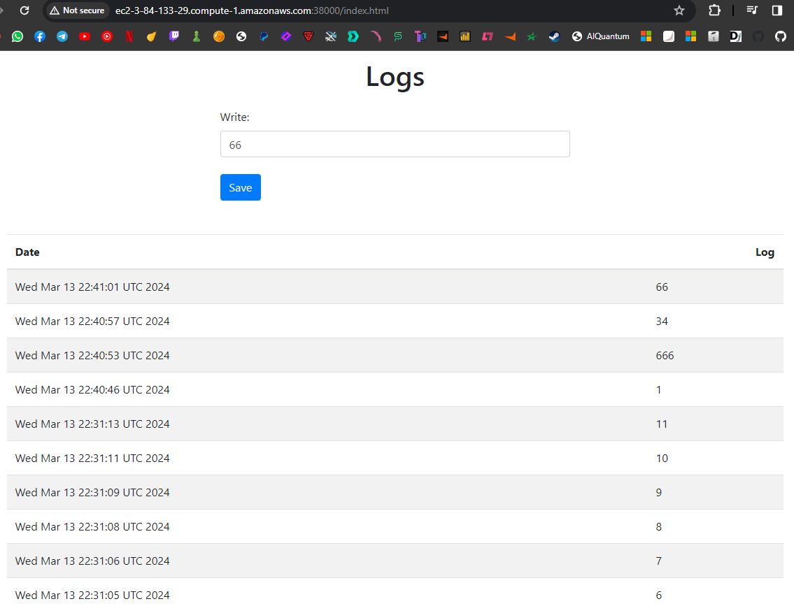
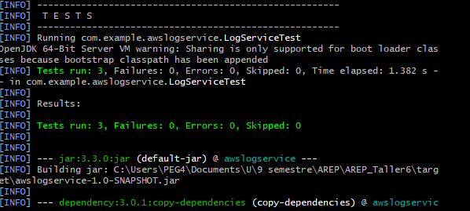
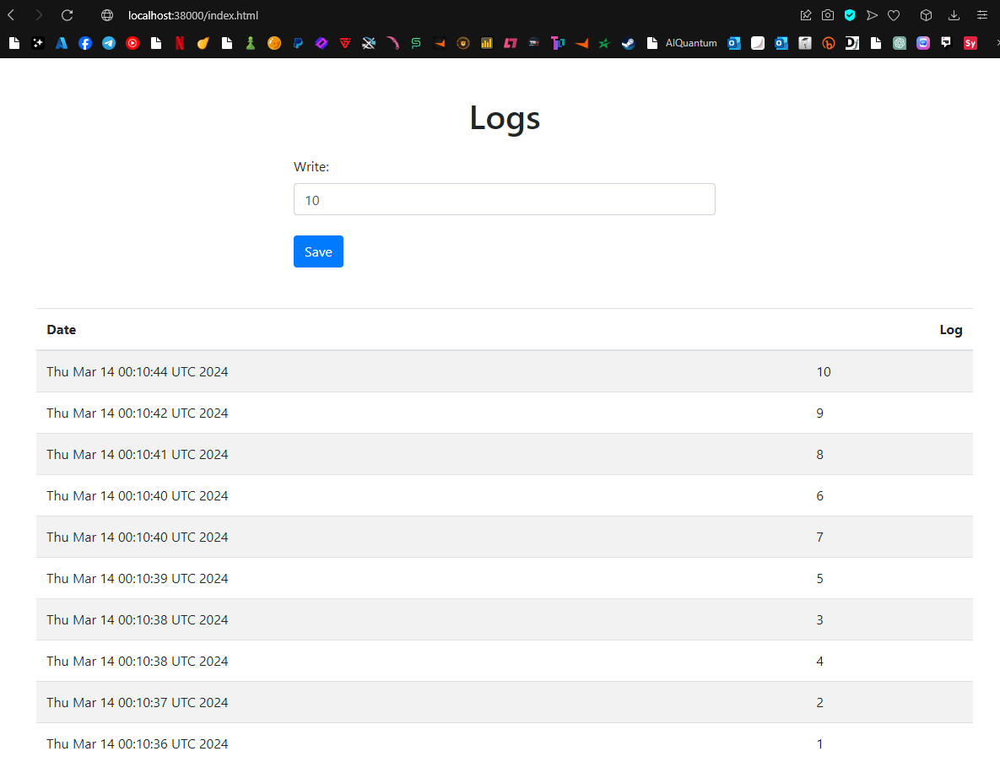

### Sergio Daniel Lopez Vargas
# AREP_Taller4

## Introducción

En el contexto del desarrollo de aplicaciones web en Java, la reflexión juega un papel fundamental al permitir la creación de frameworks y servidores que pueden analizar y manipular clases en tiempo de ejecución. En este taller, nos enfocaremos en la construcción de un servidor web tipo Apache en Java que sea capaz de servir páginas HTML e imágenes PNG, y que además proporcione un framework IoC (Inversión de Control) para la construcción de aplicaciones web a partir de POJOs (Plain Old Java Objects).

La idea principal es desarrollar un prototipo mínimo que demuestre las capacidades reflexivas de Java, permitiendo cargar un bean (POJO) y derivar una aplicación web a partir de él. Este enfoque nos permite entender cómo se puede implementar un servidor web básico que aproveche las capacidades de reflexión para el enrutamiento de solicitudes y la gestión de recursos estáticos y dinámicos.

En la primera versión de nuestro prototipo, cargaremos el POJO desde la línea de comandos, de manera similar al funcionamiento de los frameworks de prueba. Posteriormente, en la versión final, el framework IoC explorará el directorio raíz (o classpath) en busca de clases con una anotación que indique que son componentes, como por ejemplo `@Component`, para cargar todos los componentes disponibles sin necesidad de especificarlos en la línea de comandos.

## Características y Funcionalidades:

1. **Servidor Web Mínimo**: El servidor web puede manejar solicitudes HTTP básicas.
2. **Servicio de Archivos Estáticos**: Sirve archivos estáticos (como HTML, CSS, imágenes) desde un directorio predeterminado.
3. **Procesamiento de Solicitudes Dinámicas**: Procesa solicitudes que involucran componentes marcados con `@Component` y métodos marcados con `@RequestMapping`.
4. **Gestión de Parámetros de Solicitud**: Analiza y maneja parámetros de solicitud HTTP.
5. **Encabezados HTTP**: Construye encabezados HTTP apropiados para las respuestas del servidor.


## Instrucciones de Ejecución
* Clone el repositorio desde GitHub:

```
git clone https://github.com/sergiolopezzl/AREP_Taller4.git
```

* Navegue al directorio del proyecto: 

```
cd AREP_Taller4
```

* Compile el proyecto y descargue las dependencias con Maven: 

```
mvn clean package
```

* Ejecute el servidor utilizando el siguiente comando: 

```
mvn exec:java '-Dexec.mainClass=edu.escuelaing.arem.ASE.app.MovieServer'
```
## Arquitectura

1. **Escaneo de Componentes**: Utiliza la librería `Reflections` para escanear clases y encontrar métodos anotados con `@Component` y `@RequestMapping`.
2. **Inicio del Servidor**: El servidor inicia en el puerto 35000 y espera conexiones entrantes.
3. **Manejo de Solicitudes**: Cada solicitud HTTP entrante se maneja en un hilo separado.
4. **Enrutamiento de Solicitudes**: Examina la URI de la solicitud para determinar si se trata de una solicitud de archivo estático o una solicitud dinámica para un componente.
5. **Procesamiento de Solicitudes Dinámicas**: Invoca los métodos correspondientes basados en la URI de la solicitud y los parámetros proporcionados.
6. **Respuestas HTTP**: Construye respuestas HTTP apropiadas según el tipo de solicitud y contenido.

## Ejemplo de desarrollo

### Pruebas
* Se realizó la petición a http://localhost:35000/action/hola?nombre=nombre (servicio GET verificado)



* Se realizó la petición a http://localhost:35000/search.html (buscando avatar verificando el funcionamiento)



* Se realizó la petición a http://localhost:35000/action/movie?name=avatar (devolviendo el json)



* Se realizó la petición a http://localhost:35000/index.html (responde al los archivos html)


* Se realizó la petición a http://localhost:35000/img/cat.PNG (responde a la imagenes)


* Se realizó la petición a http://localhost:35000 (verificacion de funcionamiento de excepcion)


* Pruebas unitarias


